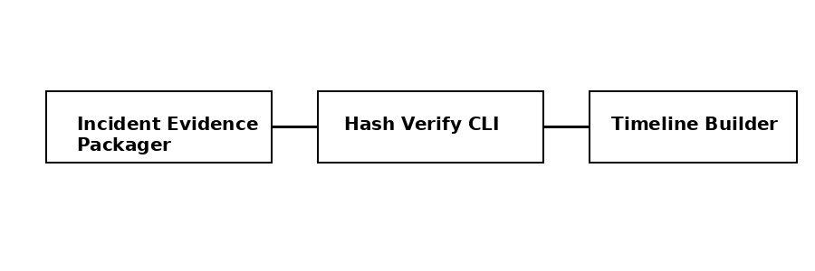

# Incident Evidence Packager

A lightweight Python utility for packaging incident response and digital forensics
evidence into a single, verifiable bundle.

## DFIR Toolchain

This tool represents the **collection** phase of a DFIR workflow.

## Features
- SHA256 hashing
- Evidence manifest and metadata
- Portable ZIP bundle
- Deterministic, no cloud dependencies

## License
MIT
